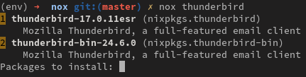

Nox
===

Nox is a small tool that makes the use of the Nix package manager
easier.

Nox is written in Python 3 and requires nix 1.8 and git. It is
released under MIT license.

Try it
------

You can install it from nixpkgs by running ``nix-env -i nox``.

To try the last version, just clone the repository, run ``nix-build``,
and run the resulting binaries in ``result/bin``. To install it, run
``nix-env -if .``.

Search
------

Just run ``nox QUERY`` to search for a nix package. The underlying
``nix-env`` invocation is cached to make the search faster than your
usual ``nix-env -qa | grep QUERY``.

Once you have the results, type the numbers of the packages to install.

Bonus: if you enter the letter 's' at the beginning of the package
numbers list, a nix-shell will be started with those packages instead.

Review
------

The ``nox-review`` command helps you find what has changed in nixpkgs, and
build changed packages, so you're sure they are not broken. There are 3 modes:

- ``nox-review revs CURRENT_REV REFERENCE_REV`` finds the differences
  between two nixpkgs revisions, and builds those packages as they are
  in ``CURRENT_REV``.
- ``nox-review wip`` compares the nixpkgs in the current working dir
  against a commit, so you can check that your changes break
  nothing. Defaults to comparing to ``HEAD`` (the last commit), but you
  can change it: ``nox-review wip --against master^'``.
- ``nox-review pr PR`` finds the packages touched by the given PR and build
  them.

Experimental
------------

I'm working on a new command, ``nox-update``, that will display
information about what is about to be updated, especially giving info
not provided by nixos-rebuild:

- Why is everything being installed?
- Which are package upgrades?
- Which are expression changes?
- Which are only rebuilds trigerred by dependency changes?
- Especially, what package triggered the rebuild?

A picture is better than a thousand words, so here is what it looks like for
now:

.. image:: http://i.imgur.com/jdOGN94.png
